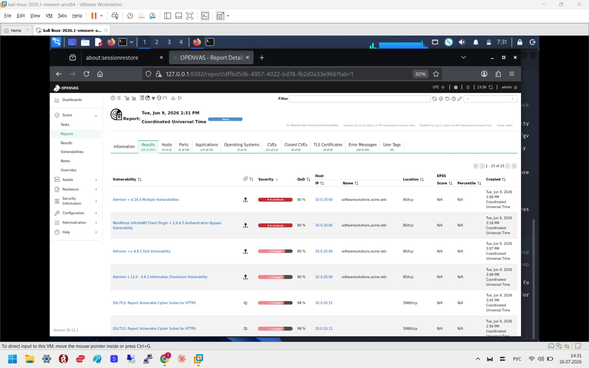
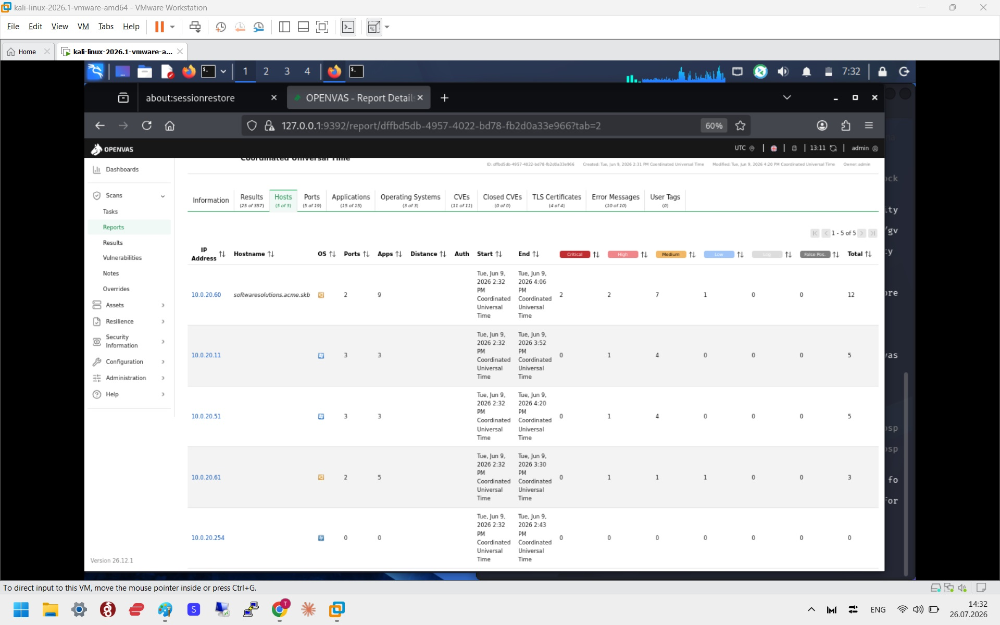
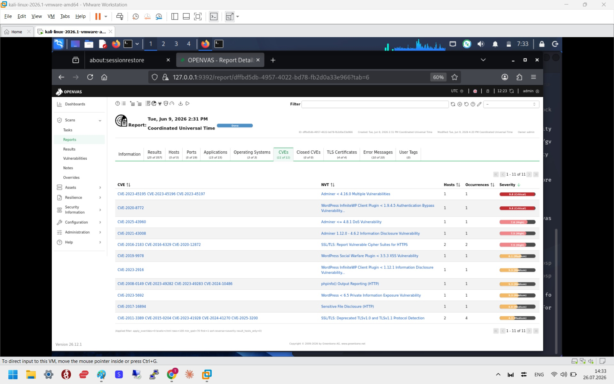

# OpenVAS Vulnerability Assessment

## 📖 Overview

This project demonstrates a practical vulnerability assessment performed using Greenbone OpenVAS.

The objective was to deploy the scanner, analyze the target system, identify security weaknesses, and provide remediation recommendations.

---

## 🎯 Objectives

- Install and configure OpenVAS
- Perform vulnerability scanning
- Analyze discovered vulnerabilities
- Assess security risks
- Recommend mitigation measures

---

## 🛠 Tools

- Kali Linux
- OpenVAS (Greenbone)
- Nmap

---

## 🧪 Lab Environment

| Component | Description |
|----------|-------------|
| Scanner | OpenVAS |
| Attacker | Kali Linux |
| Target | DVWA / Ubuntu |

---

## 📋 Workflow

1. Install OpenVAS
2. Update vulnerability feeds
3. Create target
4. Configure scan task
5. Run scan
6. Analyze results
7. Prepare report

---

## 📊 Skills Demonstrated

- Vulnerability Assessment
- Security Analysis
- CVE Review
- Risk Assessment
- Technical Reporting

---

## 📄 Documentation

The complete laboratory report is available in this repository.

---

## 📌 Status

✅ Completed

---

## 📸 Screenshots

### OpenVAS Dashboard

### Scan Results

### Vulnerability Findings

